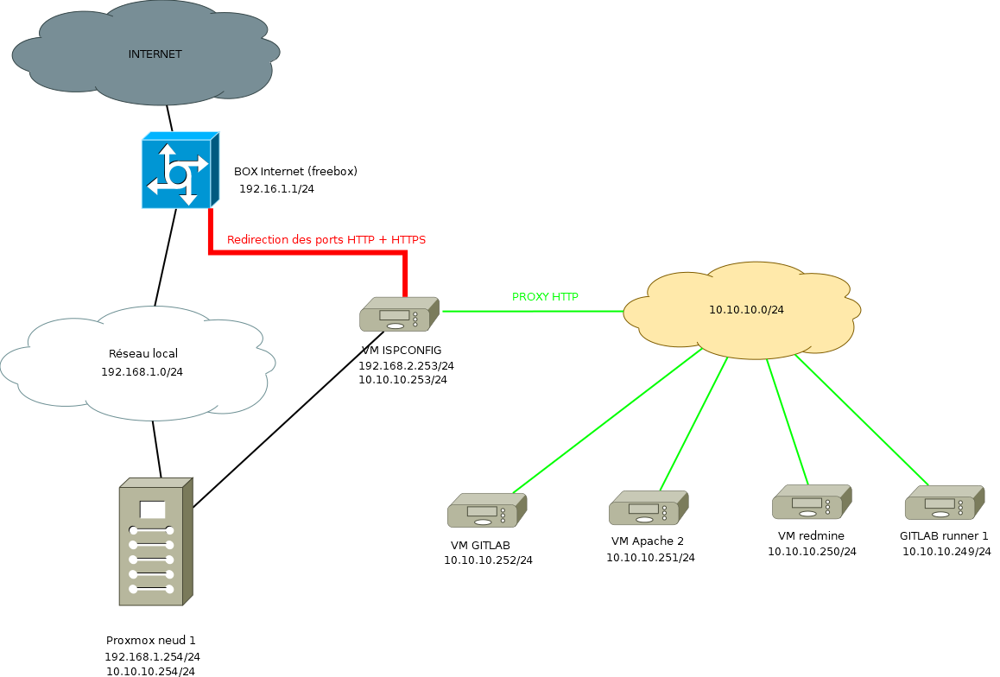
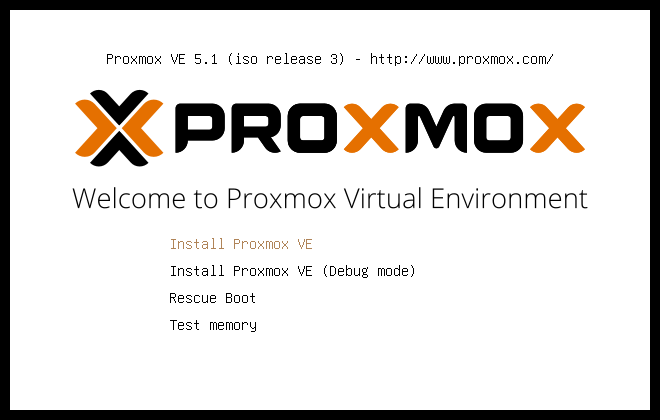
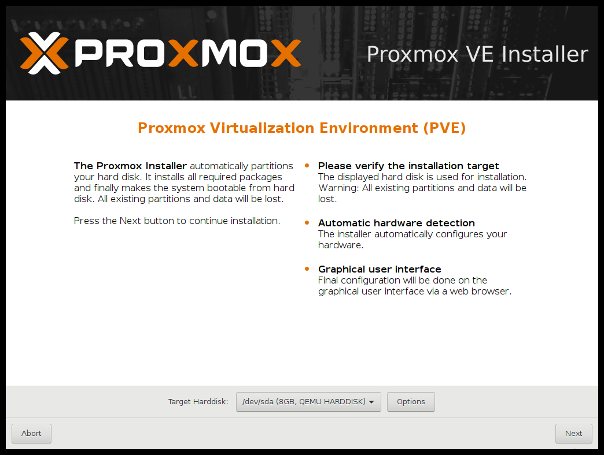
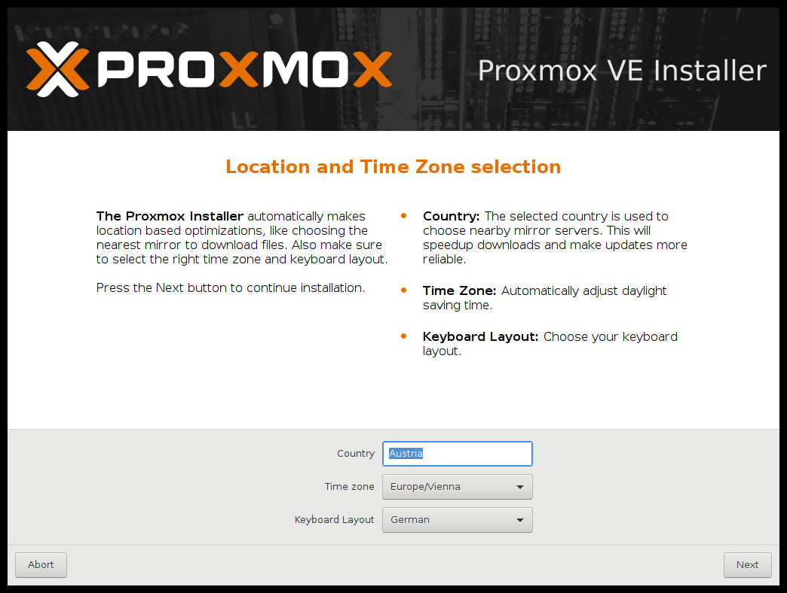
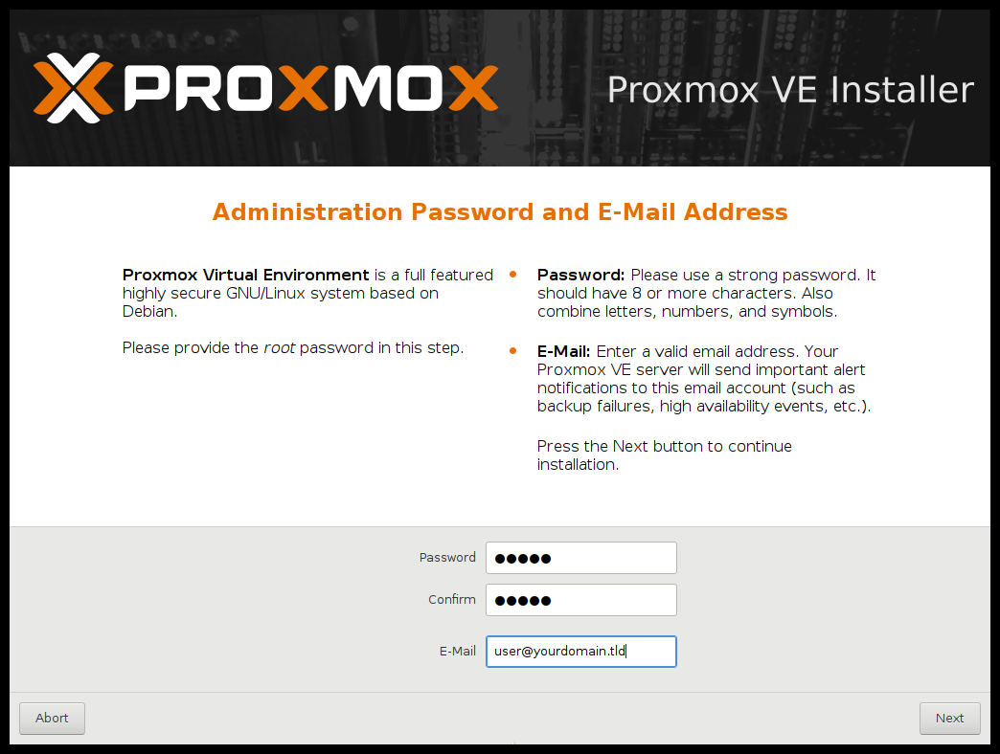
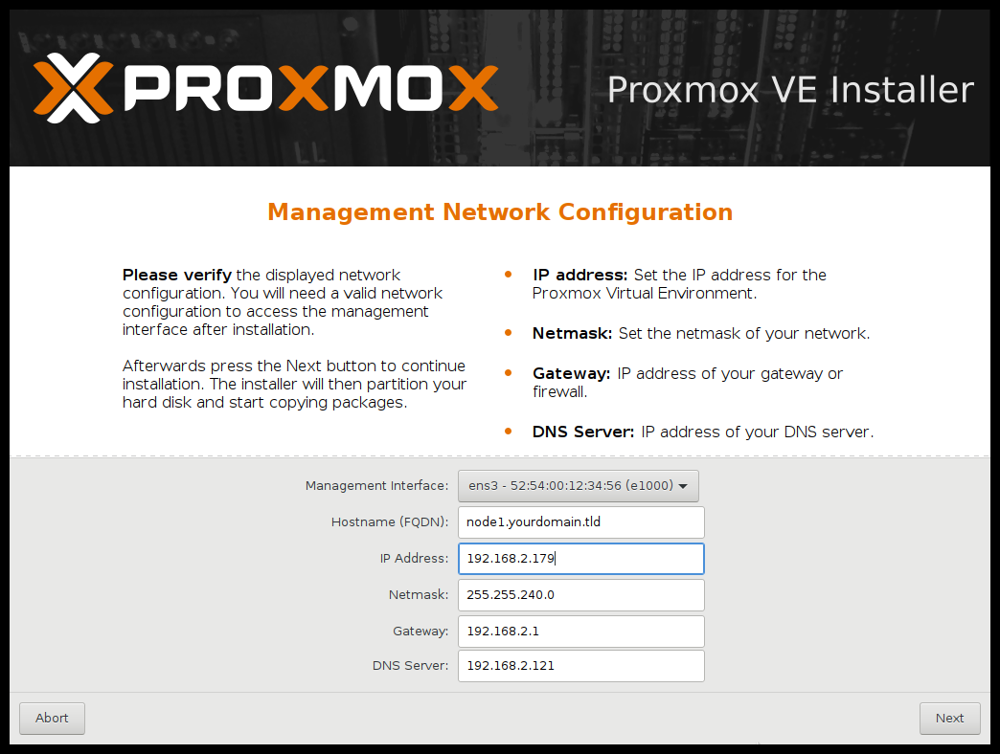
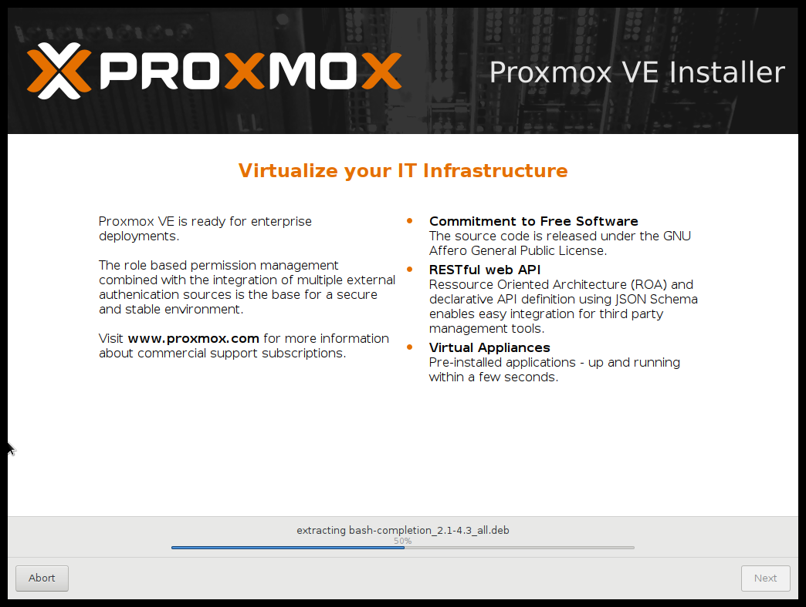
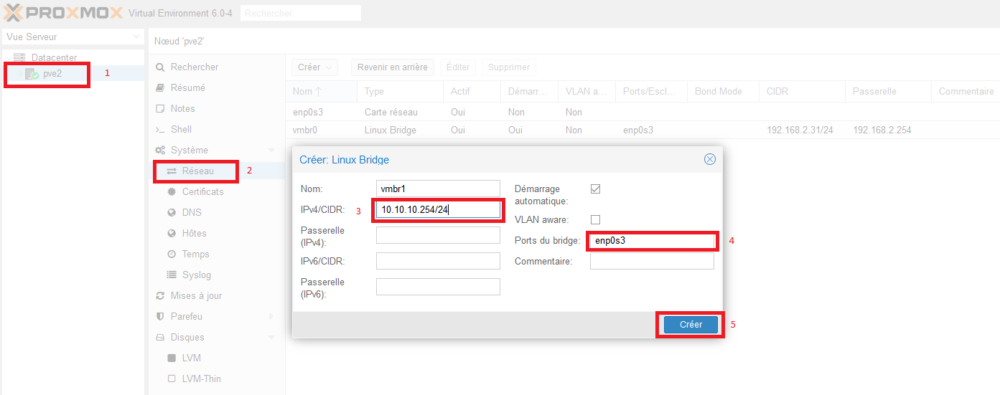
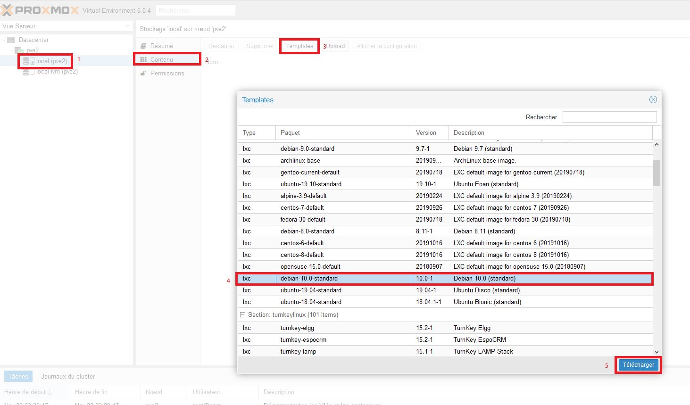

Je vous propose dans cet article de mettre en place un cluster privé permettant à la fois d'héberger vos sites web et différents services tels qu'ispconfig, Gitlab, Gitlab-CI, docker et autant d'autres que vous le souhaitez, le tout avec une seule IP publique: celle de votre Box Internet.



> Proxmox Virtual Environment est une solution de virtualisation libre basée sur l'hyperviseur Linux KVM, et offre aussi une solution de containers avec LXC. Elle propose un support payant. Elle est fournie avec un packaging par Proxmox Server Solutions GmbH.

### Pourquoi utiliser Proxmox?

- créer une VM par un simple clic
- Optimiser l'utilisation de votre matériel.
- Gérer la sauvegarde de vos VMs.

[En savoir plus sur Proxmox](https://www.proxmox.com/en/)


### Prérequis
- Un ordinateur avec au moins 8Go de RAM qui soit suffisament puissant pour faire tourner au moins 5 containers LXC simultanément et deux cartes réseaux(facultatif mais mieux si par la suite vous voulez ajouter plusieurs noeuds proxmox).
- Image ISO de Proxmox.
- Une clé USB.
- quelques heures et des nerfs solides.

### 1. Installation de Proxmox
#### Installer la distribution
##### a) Depuis une machine Débian10

Modifiez les dépôts en editant le fichier source.list:

`nano /etc/apt/sources.list`

```bash
deb http://ftp.debian.org/debian buster main contrib
deb http://ftp.debian.org/debian buster-updates main contrib

# PVE pve-no-subscription repository provided by proxmox.com,
# NOT recommended for production use
deb http://download.proxmox.com/debian/pve buster pve-no-subscription

# security updates
deb http://security.debian.org buster/updates main contrib
```

`apt-get update && apt-get install proxmox-ve`

##### b) Utilisez Proxmox VE Installer

Téléchargez l'image ISO de Proxmox VE Installer puis placez-la sur un clé USB avec Rufus ou Win32writer.
Bootez la machine avec votre clé USB et suivez les étapes suivantes :














#### Configuration du réseau

Après l'installation, notre machine Proxmox possède déjà une adresse dans le réseau local 192.168.1.0/24 (celle que vous avez choisie à l'étape précédente.
Le nom de la carte réseau peut varier en fonction de votre matériel, ici elle se nomme en01.

Par défaut le bridge vmbr1 est attaché à la carte réseau eno1 de votre machine et place les VM directement dans votre réseau local.

Nous allons ajouter un deuxième bridge rattaché à la deuxième carte réseau eno2 : vmbr1 afin d'isoler nos machines virtuelles dans un sous réseau ce qui est plus intéressant pour la sécurité.

Nous aurons besoin dans notre example de créer un nouveau bridge qui nous servira pour adresser le sous réseau 10.10.10.0/24.
- créer le bridge
- Donner l'adresse 10.10.10.254/24 au bridge.

> Ne pas spécifiez de passerelle ! En effet il ne doit y avoir qu'une seulle passerelle par noeud.



Voilà, notre cluster est prêt !

### 2. Installation d'ISPConfig
Nous allons commencer par réccupérer le template d'une Débian10 afin de pouvoir par la suite créer nos container sous Débian10.



### 3. Installation de Gitlab

Vous avez deux possibilités afin d'installer Gitlab sur votre cluster:
- Utiliser le template TURNKEY Linux fourni directement via les dépôts de Proxmox.
- Installer directement Gitlab dans un container avec la distribution de votre choix.


### 4. Installation de Gitlab-runner

### 5. Installation de la VM Apache pour Laravel